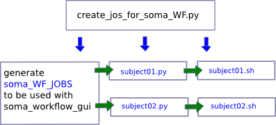

# SOMA-WORKFLOW TUTORIAL

### HOW TO USE SOMA-WORKFLOW ?
More information on [http://brainvisa.info/soma/soma-workflow/](http://brainvisa.info/soma/soma-workflow/)
and [https://github.com/neurospin/soma-workflow](https://github.com/neurospin/soma-workflow) 

### WHAT IS SOMA-WORKFLOW ?
Soma-workflow is an interface for submission, control and monitoring of jobs on parallel computing resources.
Here, we are going to describe the case where you want to use gabriel server, available
at NeuroSpin.
One parallel computing resource could be your own computer by using all processors or a specific cluster like Gabriel at NeuroSpin.
Jobs are launched in parallel and not one after the other.

### WHERE CAN I LAUNCH MY JOBS WITH SOMA WORKFLOW ?

| On your own workstation         | On a cluster     |
| --------------------------------|-----------------|
|[For multiple core machine](#from-your-own-workstation-multiple-core-machine) &nbsp;&nbsp;&nbsp;| [See the access to a cluster](#on-a-cluster)|
|Uncompiled MATLAB codes: Yes     | Uncompiled MATLAB codes: No (1)   |
|Compiled MATLAB codes: Yes       | Compiled MATLAB codes: Yes   |

1 : a MATLAB compiler is available at NeuroSpin.  

### EXAMPLE WITH FREESURFER:
An example is available on the unicog module in: 

    cd <somewhere>
    git clone https://github.com/neurospin/unicog.git
    cd <somewhere>/unicog
    python setup.py install --user 
    cd ./unicog/unicogfmri/utils_unicog/computing_resources/example
    more example_somaWF_for_freesurfer.py
    #create your own script from a copy
    cp example_somaWF_for_freesurfer.py example_somaWF_for_freesurfer_local.py
    #change what the paths and configure your freesurfer database 
    #in example_somaWF_for_freesurfer.py
    #init some variables with the following script
    source /i2bm/local/Ubuntu-12.04-x86_64/brainvisa/bin/bv_env.sh
    #launch the script
    python example_somaWF_for_freesurfer.py

This script generates the blue files. The **soma_WF_JOBS** script must 
be used in **soma-workflow_gui** for launching the jobs on the server or
on your own workstation (if many cores).

### EXAMPLE FOR SPM BATCHES:
An example is available on the unicog module in: 

    cd <somewhere>
    git clone https://github.com/neurospin/unicog.git
    cd <somewhere>/unicog
    python setup.py install --user 
    cd ./unicog/unicogfmri/utils_unicog/computing_resources/example
    more example_somaWF_for_spm_batches.py
    #create your own script from a copy
    cp example_somaWF_for_spm_batches.py example_somaWF_for_spm_batches_local.py
    #init some variables with the following script if needed
    source /i2bm/local/Ubuntu-12.04-x86_64/brainvisa/bin/bv_env.sh
    #launch the script
    python example_somaWF_for_spm_batches.py

This must generate a file called **spm12_batches.somawf** which must be
used in **soma-workflow_gui** for launching the jobs on the server or
on your own workstation (if many cores).

### FROM YOUR OWN WORKSTATION (MULTIPLE CORE MACHINE):
<a href="#PC">Launch brainvisa environment, if needed:</a>

    source /i2bm/local/Ubuntu-12.04-x86_64/brainvisa/bin/bv_env.sh

Launch soma-workflow_gui

    soma-workflow_gui
    add [DSV_cluster_your_logging] resource
    submit the python file containing jobs

More information for a [quick start on a multiple core machine](http://brainvisa.info/soma/soma-workflow/)

### ON A CLUSTER
#### CREATE AN ACCOUNT
See on the [neurospin-wiki](http://www.neurospin-wiki.org/pmwiki/Main/ComputationalResources)

Note: to edit file directly into a terminal, use **vi** tool, for instance:
    vi <name_file>

Then, use **Escape** and **i** keys to turn on the Insert mode.
To save and quit, use **Escape** and **:wq**.
 
#### HOW TO USE SOMA-WORKFLOW ?

###### CLIENT CONFIGURATION: 
The "client" refers to your workstation. 
Edit the **.soma-workflow.cfg** file on the client, if it doesn't exist, use **touch** command as below
to create it automatically:

    touch /home/your_logging/.soma-workflow.cfg

Add the following lines for the configuration of **.soma-workflow.cfg**:

    [DSV_cluster_your_logging]
    #remote access information
    CLUSTER_ADDRESS     = gabriel.intra.cea.fr
    SUBMITTING_MACHINES = gabriel.intra.cea.fr
    #optional on client
    QUEUES = run32 Global_long Global_short 
    #optional login for the GUI
    LOGIN = your_logging

<!-- 
Check into your .bashrc file you can launch /i2bm/local/Ubuntu-12.04-x86_64/brainvisa/bin/bv_env.sh, for instance:
    alias brainvisa_pkg="source /i2bm/local/Ubuntu-12.04-x86_64/brainvisa/bin/bv_env.sh"
-->

###### SERVER CONFIGURATION:
The "server" refers to the resource called Gabriel:
[See information on wiki](http://www.neurospin-wiki.org/pmwiki/Main/ComputationalResources)

Connect to gabriel from your workstation with the login/pw given for gabriel  :

    ssh your_logging_for_gabriel@gabriel.intra.cea.fr

Edit the **.soma-workflow.cfg** file on the server, if it doesn't exist, use **touch** command as below
to create it automatically:

    touch /home/your_logging/.soma-workflow.cfg

Add the following lines for the configuration of **.soma-workflow.cfg**:

    [DSV_cluster_your_logging]
    NATIVE_SPECIFICATION = -l walltime=20:00:00
    DATABASE_FILE        = /home/your_logging/soma-workflow/soma_workflow.db
    TRANSFERED_FILES_DIR = /home/your_logging/soma-workflow/transfered-files/
    NAME_SERVER_HOST     = gabriel.intra.cea.fr
    SERVER_NAME          = soma_workflow_database_your_logging
    DRMAA_IMPLEMENTATION = PBS
    SERVER_LOG_FILE   = /home/your_logging/soma-workflow/logs/log_server
    SERVER_LOG_FORMAT = %(asctime)s => line %(lineno)s: %(message)s
    SERVER_LOG_LEVEL  = ERROR
    ENGINE_LOG_DIR    = /home/your_logging/soma-workflow/logs
    ENGINE_LOG_FORMAT = %(asctime)s => %(module)s line %(lineno)s: %(message)s %(threadName)s
    ENGINE_LOG_LEVEL  = ERROR
    PATH_TRANSLATION_FILES = brainvisa{/home/your_logging/.brainvisa/soma-workflow.translation}
    MAX_JOB_IN_QUEUE = {5} run32{5} Global_long{5}

Create the following directories, if needed:

    mkdir /home/your_logging/soma-workflow
    mkdir /home/your_logging/soma-workflow/logs
    mkdir /home/your_logging/soma-workflow/soma-workflow
    mkdir /home/your_logging/soma-workflow/transfered-files

Open the .bashrc file and check if the following lines exist, if not, add them:

    # .bashrc
    # Source global definitions
    if [ -f /etc/bashrc ]; then
        . /etc/bashrc
    fi

    # User specific aliases and functions
    if [ -f /i2bm/local/etc/bashrc ]; then
       . /i2bm/local/etc/bashrc
    fi

    if [ -f /i2bm/local/etc/profile ]; then
       . /i2bm/local/etc/profile
    fi 

And add the following lines:

    export I2BM_OSID=CentOS-5.11-x86_64
    
    export PYTHONPATH=/i2bm/brainvisa/$I2BM_OSID/python-2.7.3/lib/python2.7:$PYTHONPATH
    export PYTHONPATH=/i2bm/brainvisa/$I2BM_OSID/python-2.7.3/lib/python2.7/site-packages:$PYTHONPATH
    export PATH=/i2bm/brainvisa/$I2BM_OSID/python-2.7.3/bin:$PATH
    export LD_LIBRARY_PATH=/i2bm/brainvisa/$I2BM_OSID/python-2.7.3/lib:$LD_LIBRARY_PATH
    export LD_LIBRARY_PATH=/i2bm/brainvisa/$I2BM_OSID/pbs_drmaa-1.0.13/lib/:$LD_LIBRARY_PATH
    export LD_LIBRARY_PATH=/usr/lib64/openmpi/lib:${LD_LIBRARY_PATH}
    export DRMAA_LIBRARY_PATH=/i2bm/brainvisa/$I2BM_OSID/pbs_drmaa-1.0.13/lib/libdrmaa.so
    
    source /i2bm/brainvisa/$I2BM_OSID/brainvisa/bin/bv_env.sh /i2bm/brainvisa/$I2BM_OSID/brainvisa

In order to complete the configuration (initialisation of PATH_TRANSLATION_FILES in .soma-workflow.cfg),
launch Brainvisa just once. So, quit the server side (gabriel), then relog with the option -X to indicate the graphic mode.

    ssh  -X your_logging@gabriel.intra.cea.fr
    #launch brainvisa
    brainvisa
    #and just close the graphical interface of Brainvisa.

Launch soma-workflow on Gabriel (if soma_workflow is not started on your gabriel count, 
you can't launch soma-workflow_gui from your workstation):

    python -m soma_workflow.start_database_server DSV_cluster_your_logging
    #to move the programm in background, use ctrl + Z then tape bg

Check if soma_workflow.start_database_server is started:

    ps -aux | grep your_logging

If you have a line like the one below, the configuration is correct:

    python -m soma_workflow.start_database_server DSV_cluster_your_logging &
